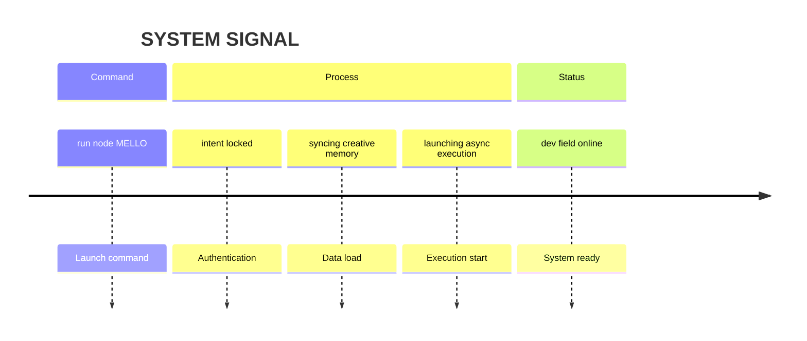

# NEØ // NODE DEV 

`active node: MELLØ`

This is not a repo.  
This is a **cognitive dev surface**.

---

## CORE LINKS

→ Template Engine  
https://github.com/neomello/neo-template

→ Modules in Play  
`/stantards/` — check.

---

## SYSTEM SIGNAL

---

[dev field online]

